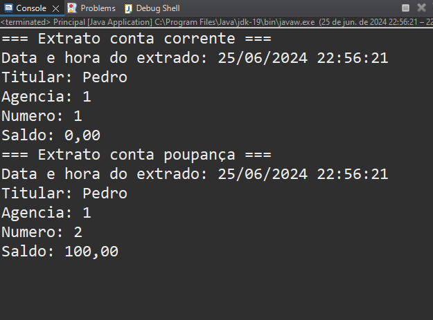

# Banco Dio

Este projeto é uma implementação simples de um sistema bancário em Java, projetado para demonstrar os princípios da programação orientada a objetos (POO). Inclui funcionalidades básicas como criação de contas, depósitos, saques e transferências, utilizando Lombok para reduzir o código boilerplate.

## Objetivos

O principal objetivo deste projeto é mostrar a aplicação dos princípios da POO em Java. Os principais princípios demonstrados neste projeto são:

- **Encapsulamento:** Agrupamento de dados (atributos) e métodos (funções) em uma única unidade, como uma classe.
- **Herança:** Criação de novas classes com base em classes existentes para promover a reutilização de código.
- **Polimorfismo:** Permitir que objetos sejam tratados como instâncias de sua classe pai, em vez de sua classe real.
- **Abstração:** Ocultação de detalhes complexos de implementação e exibição apenas das funcionalidades necessárias de um objeto.

## Classes

### Cliente
Representa um cliente do banco.

### Conta
Uma classe abstrata que representa uma conta bancária genérica. Implementa a interface `IConta` e fornece funcionalidades básicas como:
- Depósito (`depositar`)
- Saque (`sacar`)
- Transferência (`transferir`)

#### ContaCorrente
Uma subclasse de `Conta` que representa uma conta corrente.

#### ContaPoupanca
Uma subclasse de `Conta` que representa uma conta poupança.

### Banco
Representa um banco com uma lista de contas.

### Principal
A classe principal para executar a aplicação. Demonstra a criação de um cliente e contas, a realização de operações e a impressão de extratos de conta.

## Configuração do Lombok no Eclipse

1. Baixe o jar do Lombok de [https://projectlombok.org/download](https://projectlombok.org/download).

2. Execute o jar do Lombok com o comando:
    ```sh
    java -jar lombok.jar
    ```
   
3. O instalador do Lombok irá abrir. Clique no botão "Specify location" e selecione o diretório de instalação do Eclipse, depois clique em "Install/Update".

4. Reinicie o Eclipse.

5. Adicione o Lombok ao seu projeto:
    - Clique com o botão direito no seu projeto no Eclipse.
    - Selecione **Properties**.
    - Vá para **Java Build Path** -> **Libraries** -> **Add External JARs**.
    - Selecione o jar do Lombok que você baixou.  

## Uso

A classe `Principal` demonstra o uso básico do sistema bancário:

```java
package bancoDio;

public class Principal {

    public static void main(String[] args) {
        Cliente pedro = new Cliente();
        pedro.setNome("Pedro");

        Conta cc = new ContaCorrente(pedro);
        cc.depositar(100);

        Conta cPoupanca = new ContaPoupanca(pedro);
        cc.transferir(100, cPoupanca);

        cc.imprimirExtrato();
        cPoupanca.imprimirExtrato();
    }
}
 ```
## Saída Exemplo


